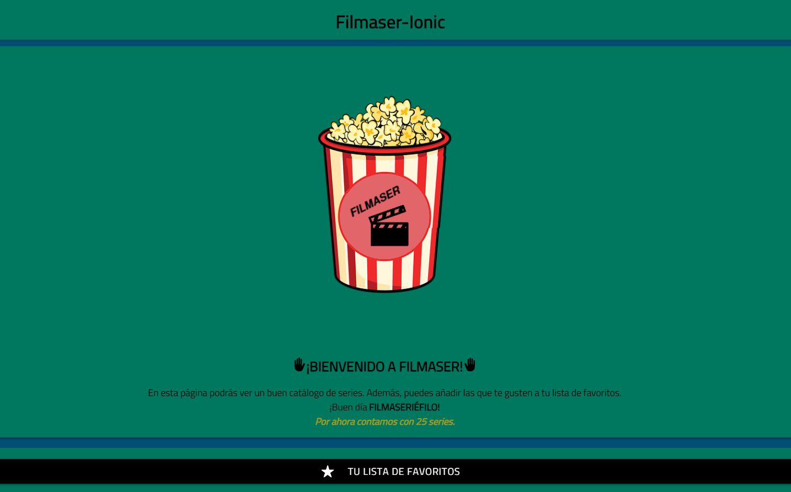
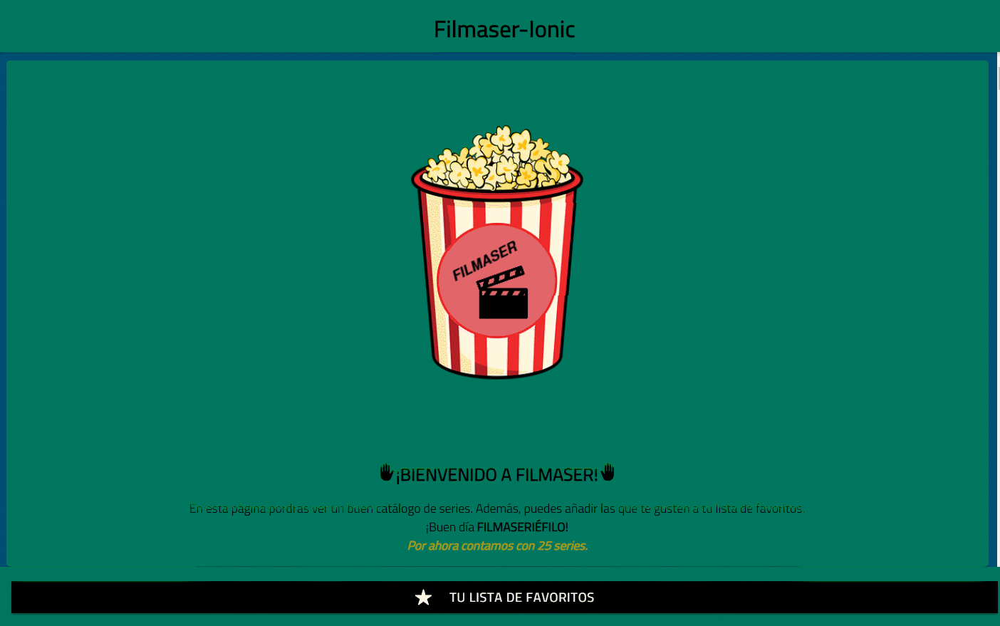
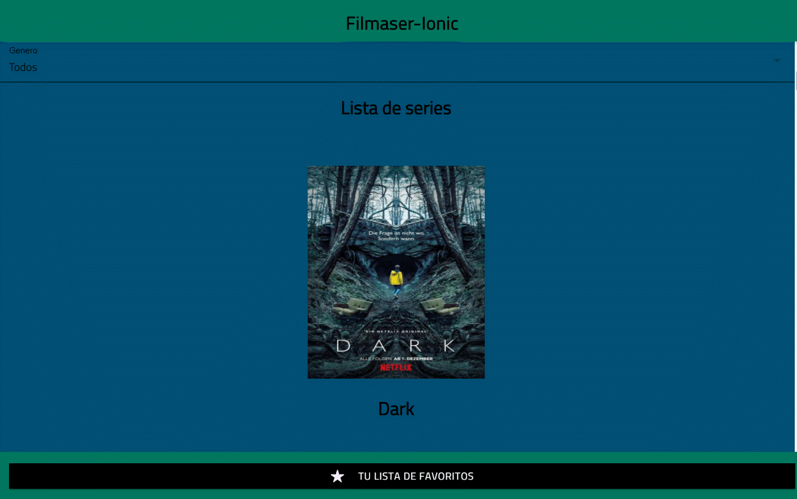
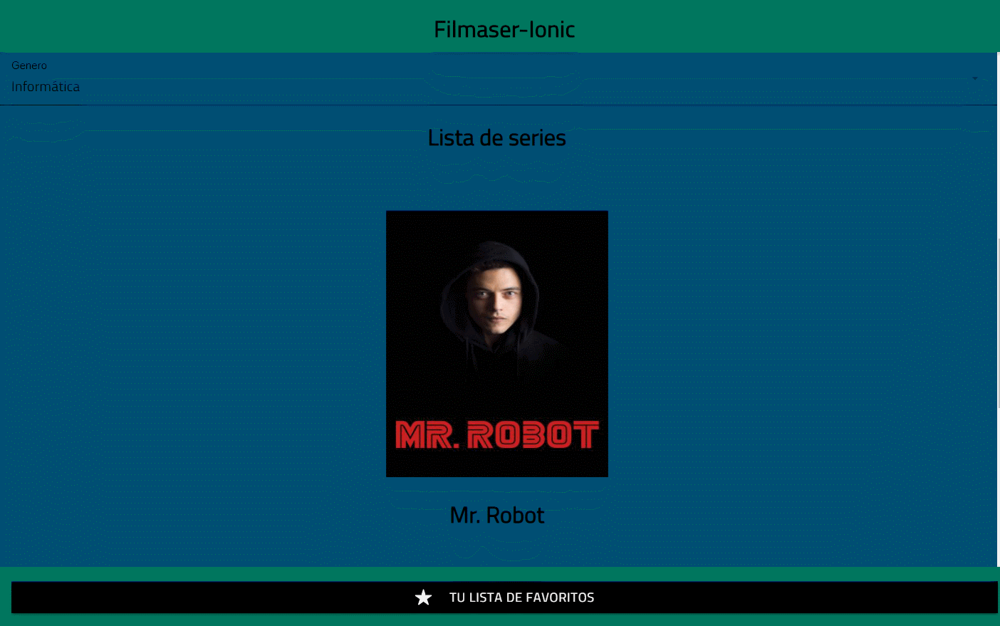

# Filmaser-Ionic

Filmaser es una aplicación hecha con Ionic para la asignatura de Acceso a Datos correspondiente al segundo año de Desarrollo de Aplicaciones Multiplataforma.

Esta aplicación consiste en una lista de series que puedes añadir a una lista de favoritos.

¡Próximamente se añadirá la lista de pendientes para tener una mayor organización y otras funcionalidades más!

Cuando entras se ve esta presentación de la aplicación.

# Presentación

Al bajar se puede filtrar por géneros y se ve la lista de series.

# Filtrar por géneros

Así se puede filtrar el género.

# Información de la serie

Al pulsar sobre una serie aparece información de la misma y se puede añadir a tu lista.

# Lista de favoritos

En la lista de favoritos, se ve las series que se han añadido y se pueden borrar si es lo deseado.

# Listado de series

Por ahora, la aplicación cuenta con estas series.

Gracias por visitar este repositorio. 

