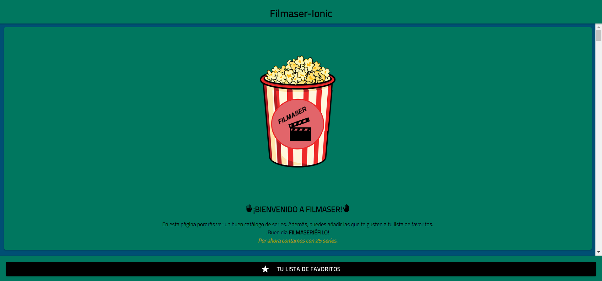

# Filmaser-Ionic

Filmaser es una aplicación hecha con Ionic para la asignatura de Acceso a Datos correspondiente al segundo año de Desarrollo de Aplicaciones Multiplataforma.

Esta aplicación consiste en una lista de series y estas las puedes añadir a una lista de favoritos.

